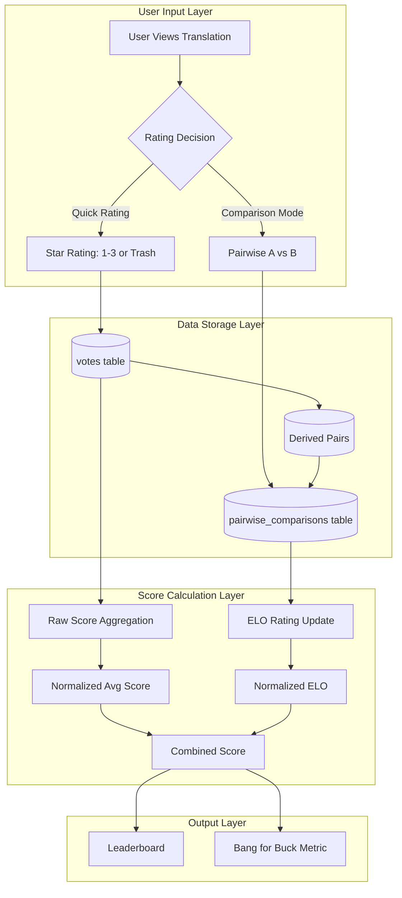
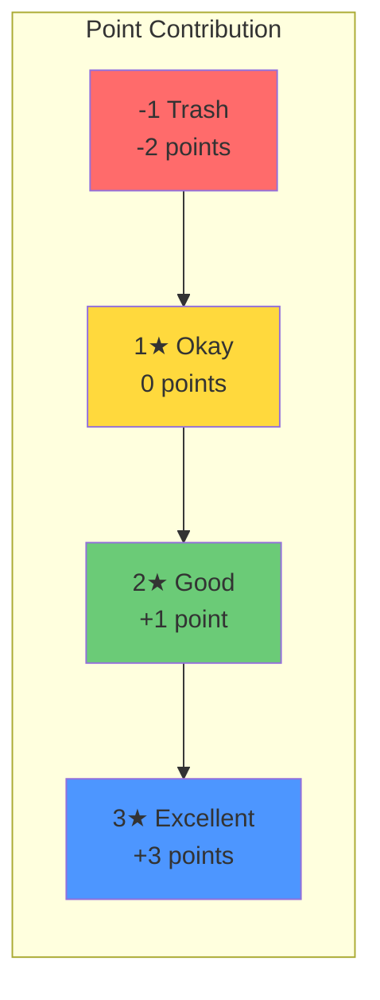
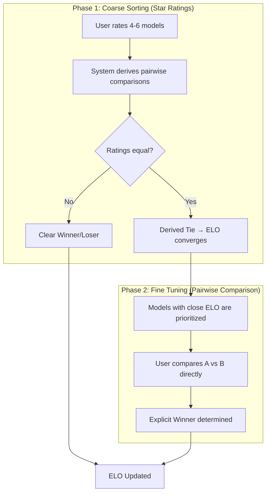
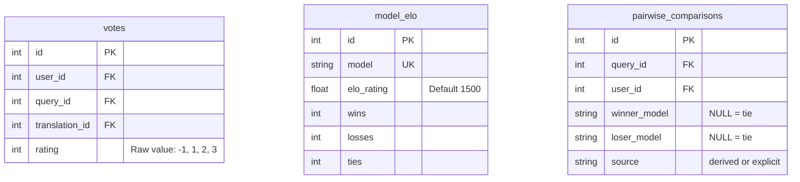

# Ranking Methodology: Design Rationale and Technical Analysis

## Executive Summary

This document provides a rigorous academic analysis of the ranking methodology used in the Dhivehi Translation Arena. The system combines **absolute quality ratings** (star-based) with **relative performance metrics** (ELO-based) to produce a robust, statistically sound ranking of translation models.

---

## 1. System Overview



---

## 2. Rating Scale Design

### 2.1 The 4-Point Ordinal Scale

| Rating | Label | User Intent | Score Contribution |
|:------:|:------|:------------|:------------------:|
| **3★** | Excellent | "Ship it. No editing needed." | **+3** |
| **2★** | Good | "Meaning correct, needs polish." | **+1** |
| **1★** | Okay | "Errors present, but understandable." | **0** |
| **-1** | Trash | "Wrong meaning, gibberish, or off-topic." | **-2** |

### 2.2 Rationale for 4 Points (Not 5 or 10)

#### Cognitive Load Theory (Miller, 1956)
George Miller's research on human working memory capacity ("The Magical Number Seven, Plus or Minus Two") suggests that humans can reliably discriminate between 5-9 categories. However, for **rapid, intuitive judgments**:

- **3-4 categories** maximize inter-rater reliability
- **5+ categories** introduce noise without adding signal

#### Translation Quality Assessment (TQA) Standards
Professional localization uses similar severity scales:

| Industry Standard (MQM) | Our Equivalent |
|:------------------------|:---------------|
| No Error / Perfect | 3★ Excellent |
| Minor Error | 2★ Good |
| Major Error | 1★ Okay |
| Critical Error / Unusable | -1 Trash |

### 2.3 Non-Linear Point Mapping

The point mapping `[+3, +1, 0, -2]` is intentionally non-linear:



#### Design Philosophy: "Consistency Over Variance"

| Scenario | Total Points | Interpretation |
|:---------|:------------:|:---------------|
| 4× Good (2★) | 4 × 1 = **4** | Reliable, predictable |
| 2× Excellent + 2× Trash | (2×3) + (2×-2) = **2** | High variance, risky |

This rewards models that *consistently* perform well over models that occasionally excel but also frequently fail.

**Alternative Considered: Linear Scale `[0, 1, 2, 3]`**
- Pros: Simpler, treats all steps equally
- Cons: Does not adequately penalize "Trash" outputs, which are actively harmful in production use
- Decision: **Rejected** in favor of current system

---

## 3. Hybrid Scoring: Stars + ELO

### 3.1 Why Two Metrics?

| Metric | Type | Measures | Bias Profile |
|:-------|:-----|:---------|:-------------|
| **Star Rating** | Absolute | "How good is this translation?" | Leniency bias (users rate high) |
| **ELO Rating** | Relative | "Is this better than that?" | Zero-sum (self-correcting) |

Combining them creates a **robust consensus** that resists individual biases.

### 3.2 The "Funnel" Strategy



**Phase 1** handles the "easy" work (identifying obvious trash vs. good).
**Phase 2** handles the "hard" work (resolving ties between top contenders).

### 3.3 Derived Comparisons from Ratings

When a user submits ratings for multiple models on the same query:

| User Ratings | Derived Comparison | ELO Impact |
|:-------------|:-------------------|:-----------|
| A=3★, B=1★ | A defeats B | A↑, B↓ |
| C=3★, D=3★ | Tie | C≈D (ratings converge) |
| E=2★, F=-1 | E defeats F | E↑, F↓ |

This is a **round-robin tournament** conducted implicitly from a single rating session.

---

## 4. Normalization and Weighting

### 4.1 Normalization Formulas

#### Star Rating Normalization
Raw average score range: `[-2, +3]` (all Trash to all Excellent)

$$\text{Normalized Rating} = \frac{\text{Avg Score} + 2}{5}$$

Maps to `[0.0, 1.0]`.

#### ELO Normalization
Assumed practical ELO range: `[1000, 2000]`

$$\text{Normalized ELO} = \frac{\text{ELO} - 1000}{1000}$$

Maps to `[0.0, 1.0]`, with 1500 → 0.5 (neutral).

### 4.2 Empirical Observations

From our database analysis (N=313 votes):

| Metric | Empirical Mean | Theoretical Neutral | Gap |
|:-------|:--------------:|:-------------------:|:---:|
| Normalized Rating | **0.665** | 0.50 | +0.165 |
| Normalized ELO | **0.500** | 0.50 | 0.000 |

The **+0.165 "Optimism Gap"** indicates systematic leniency bias in user ratings.

### 4.3 Weighting Decision

#### Option A: 50% Rating / 50% ELO (Current)
- Pros: Simple, intuitive
- Cons: Inherits leniency bias from ratings

#### Option B: 40% Rating / 60% ELO (Recommended)
- Pros: Partially corrects for optimism gap
- Cons: Slightly more complex to explain

#### Option C: Bias-Corrected Normalization
- Formula: `adjusted_rating = normalized_rating - 0.165`
- Pros: Mathematically precise
- Cons: Requires periodic recalibration as data grows

**Decision: Option B (40/60)**

Rationale:
1. **Arena Philosophy**: This is a competitive arena; relative performance (ELO) should outweigh isolated satisfaction (ratings).
2. **Bias Reduction**: 60% ELO weight dilutes the optimistic rating bias.
3. **Simplicity**: No "magic constant" that requires recalibration.

---

## 5. Combined Score Formula

### Current (50/50):
$$\text{Combined Score} = 0.5 \times \text{Norm Rating} + 0.5 \times \text{Norm ELO}$$

### Proposed (40/60):
$$\text{Combined Score} = 0.4 \times \text{Norm Rating} + 0.6 \times \text{Norm ELO}$$

### Impact Simulation

| Model | Norm Rating | Norm ELO | Combined (50/50) | Combined (40/60) | Δ |
|:------|:-----------:|:--------:|:----------------:|:----------------:|:-:|
| Gemini 3 Pro Low | 0.94 | 0.76 | 0.85 | 0.83 | -0.02 |
| Gemini 3 Flash | 0.80 | 0.50 | 0.65 | 0.62 | -0.03 |
| Claude Sonnet 3.5 | 0.62 | 0.46 | 0.54 | 0.52 | -0.02 |

The shift is minor (~0.02-0.03) but systematically rewards models with strong *competitive* records.

---

## 6. Data Integrity Analysis

### 6.1 Database Schema



### 6.2 Separation of Concerns

| Layer | What is Stored | What is Calculated |
|:------|:---------------|:-------------------|
| **votes** table | Raw rating (-1, 1, 2, 3) | — |
| **stats_service.py** | — | Point contribution (+3, +1, 0, -2) |
| **stats_service.py** | — | Normalized score, combined score |

**Key Insight**: The **labels** ("Excellent", "Good") and **point mappings** (+3, +1, 0, -2) are application logic, not stored data.

✅ Changing labels/descriptions: **Safe** (does not affect historical data)
✅ Changing weighting: **Safe** (recalculates on-the-fly)
⚠️ Changing point mapping: **Affects all historical calculations retroactively**

---

## 7. Psychological Considerations

### 7.1 Known Rating Biases

| Bias | Description | Mitigation |
|:-----|:------------|:-----------|
| **Leniency Bias** | Raters give higher scores than warranted | Weight ELO more (60%) |
| **Central Tendency** | Raters avoid extremes (rarely use -1 or 3) | Non-linear point scale rewards 3★ heavily |
| **Acquiescence** | Tendency to agree/approve | Pairwise comparison forces discrimination |
| **Contrast Effect** | Side-by-side comparison is harsher | Use both modes to balance |

### 7.2 Inter-Rater Reliability

With only 1-3 active users, traditional inter-rater reliability metrics (Cohen's Kappa) are not applicable. However, the **ELO system inherently addresses this** by treating each comparison as a datapoint, regardless of rater.

---

## 8. Alternative Approaches Considered

### 8.1 Bradley-Terry-Luce (BTL) Model
- A probabilistic model for pairwise comparisons
- Pros: Maximum likelihood estimation, handles incomplete data
- Cons: More complex, requires specialized libraries
- Decision: **Deferred** for future consideration; ELO is simpler and well-understood

### 8.2 TrueSkill (Microsoft)
- Bayesian rating system used in Xbox Live
- Handles multiplayer (>2) comparisons
- Pros: Models uncertainty explicitly
- Cons: Overkill for our N; ELO is sufficient
- Decision: **Rejected**

### 8.3 Pure Pairwise (No Star Ratings)
- Only use Quick Compare mode
- Pros: Eliminates leniency bias entirely
- Cons: Much higher user effort (N² comparisons vs N ratings)
- Decision: **Rejected**; hybrid is more efficient

---

## 9. Recommendations

1. **Apply 40% Rating / 60% ELO weighting** to better balance the optimism gap.
2. **Maintain current 4-point rating scale**; it is cognitively optimal and industry-aligned.
3. **Continue hybrid "Funnel" strategy** for efficient data collection.
4. **Monitor the Optimism Gap** over time; if it changes significantly (±0.05), consider Option C (explicit bias correction).

---

## Appendix A: Glossary

| Term | Definition |
|:-----|:-----------|
| **ELO Rating** | A zero-sum rating system where players gain points from wins and lose points from losses |
| **K-Factor** | The sensitivity of ELO updates (our K=32, moderate responsiveness) |
| **Derived Comparison** | A pairwise result inferred from star ratings (e.g., 3★ vs 1★ → win) |
| **Explicit Comparison** | A pairwise result from direct user choice in Compare mode |
| **Normalized Score** | A metric scaled to the range [0, 1] for easy combination |
| **Combined Score** | The weighted average of Normalized Rating and Normalized ELO |

---

## Appendix B: Database Verification Query

```sql
-- Check current vote distribution
SELECT rating, COUNT(*) as count FROM votes GROUP BY rating ORDER BY rating;

-- Sample output:
-- -1 | 36
-- 1  | 50
-- 2  | 110
-- 3  | 117
```

This confirms that raw integer values (-1, 1, 2, 3) are stored, not labels or points.

---

## References

1. Miller, G. A. (1956). "The Magical Number Seven, Plus or Minus Two: Some Limits on Our Capacity for Processing Information." *Psychological Review*.
2. Elo, A. E. (1978). *The Rating of Chessplayers, Past and Present*. Arco.
3. LISA QA Model & MQM (Multidimensional Quality Metrics). *Localization Industry Standards Association*.
4. Bradley, R. A., & Terry, M. E. (1952). "Rank Analysis of Incomplete Block Designs: I. The Method of Paired Comparisons." *Biometrika*.
